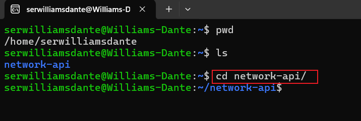

# Linux Project Implementation

In this project we will be implimenting some basic linux commands

## Sudo Command

The Sudo command is also known as the super user do command which is used to grant administrative privilages to a certain user to manipulate root files and folders.

to use the sudo command we use the following syntax `sudo apt upgrade`

## PWD Command

fgfdsfgrrgrsgsdfggsgfsgsgsfddgsggsfgssgsdgsgsg

## CD Command

fgdfhdhhgsgsgsgfhfdfhfhdfhdfhdfhfdhhfdfdfhhdf

